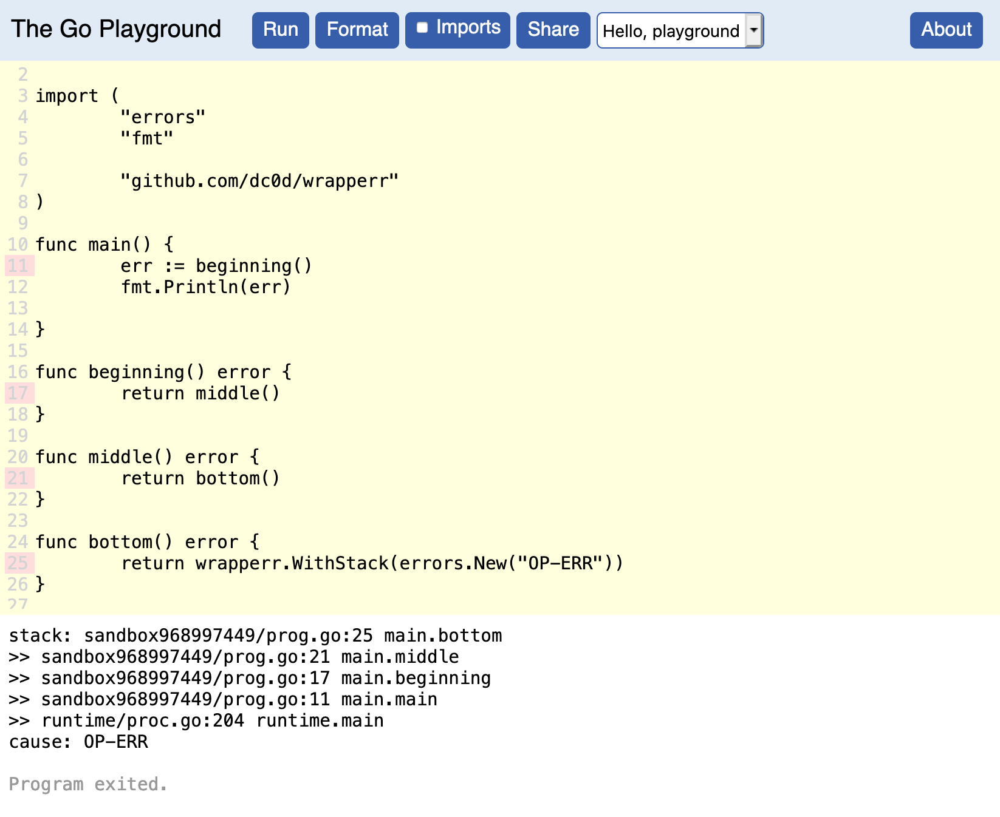
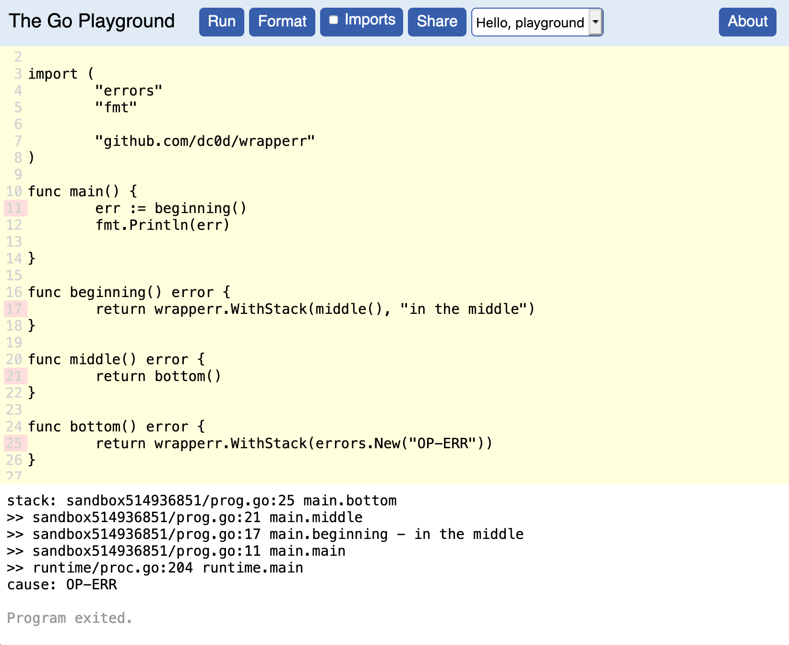

[](https://pkg.go.dev/github.com/dc0d/wrapperr) [](https://goreportcard.com/report/github.com/dc0d/wrapperr) [](https://codeclimate.com/github/dc0d/wrapperr/maintainability) [](https://codeclimate.com/github/dc0d/wrapperr/test_coverage)

# wrapperr

_Where_ did that error happen down the call chain?

> Right at the bottom!

<div align="center">

</div>

<br />

All you need to do is, instead of:

```go
return nil, err
```

Do:

```go
return nil, wrapperr.WithStack(err)
```

Also, it is possible to annotate the stack in the middle:

<div align="center">

</div>

<br />

And to get the original error, just used the standard `errors.Unwrap(error)` function from built-in `errors` package.
